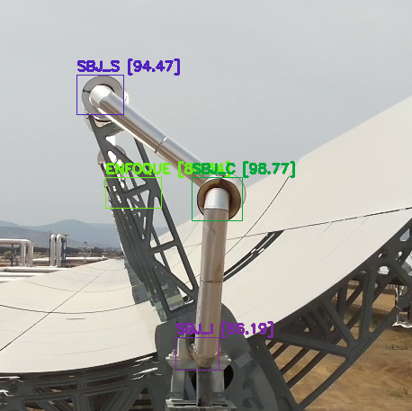
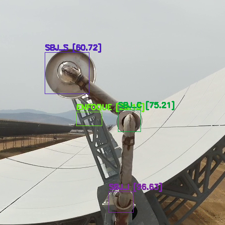

# **Bolt Joint Detection**

This reposity it's created as deliberable for the project started along Cobra for detecting failures on thermosolar panels.

---

## **Repository Contents**

1. **YOLOv5 Model**
   - Model trained for detecting joints with around 2000 images.
   - Ultralytics as framework for working easily with the model.

2. **2 Different Datasets**
   - One trained for the standard joint detection, another for locating bases of the colector.
   - Dataset source.
   - Datasets are structured in the classic (train, test, validation) schema, and in yolo format, see the datasets to include more information if wanted.

3. **Video Processing**
   - The scripts process all videos and srt within a folder called `VIDEOS` (you must create it) and calculate the angles for each full detection. Then, it geolocalizes the colector and saved the angle.
   - Once you have all videos and map ready, just run ``` python3 detections.py```, it will throws everything in a folder called `salida`.

4. **Map Generation**
   - `coordenadas.py` it is able to map all colector within a plant with just a few parameters and coordinates. Change then as needed and run it with `python3 coordenadas.py`.
   - The code will throw a text file that you can name however you want and an html file that lets you visualize the map. Change the map you want to use in file called `MODULOS/Identificar_Colector.py`.

---

## **Prerequisites**

- Python 3.10.
- Ultralytics.
- OpenCV and NumPy.

---

## **Installation**

1. Clone the repository:
   ```bash
   git clone (https://github.com/TermosolIA/SBJ_yolo.git)
   cd SBJ_yolo
   ```

2. Install dependencies:
   ```bash
   pip install -r requirements.txt
   ```

---

## **Usage**

### **1. Generate Pre-Processing Maps if needed**

Enter `coordenadas.py` script, you will need to modify this section:
``` 
# Example usage
num_rows = 84
row_separation = 17.21  # 17.2 meters between each row
panel_separation = 80 # Configurable distance between north and south panels

hallways = [(38.622555,-6.754470),(38.62531,-6.75432),(38.62819,-6.75425),(38.63104,-6.75419),(38.63381,-6.75410)]  # Example starting hallway coordinates
hallway_ends = [(38.62224,-6.73790),(38.62499,-6.73790),(38.62788,-6.73779),(38.63073,-6.73773),(38.63347,-6.73758)]  # Example ending hallway coordinates
letters = [('A', 'A'),('C', 'B'),('E', 'D'),('G', 'F'),('H', 'H')]  # Letters for north and south groups in each hallway
```
Where hallways and hallway_ends are the coordinates in long,lat of the hallways where colectors are located. Letters represent the name they have asigned, for example, the second hallway contains C and B colector, first on the upper part and second on the lower part using map visualization. We recommend using `https://www.openstreetmap.org/` for that purpose.
Run the map generation script:
```bash
python3 coordenadas.py
```
Then, rename the map as you want and put it on `MODULOS/mapas` folder, remember to change the map you want to use on `MODULOS/Identificar_Colector.py`.

### **2. Process Videos with YOLO**
Run the video processing script:
```bash
python3 detections.py
```

### **3. Train YOLO (Optional)**
If you want to re-train the model, follow these steps:

Download the Datasets in the link provided
Unzip them and throw the folder data on `SBJ_yolo` folder.
Add any aditional data you have annotated, the following images are a sample on how to lable properly:




Then, run this code(make sure that this files have proper paths for your user `data.yaml, train.txt, val.txt` )
```bash
python3 training.py
```


---

